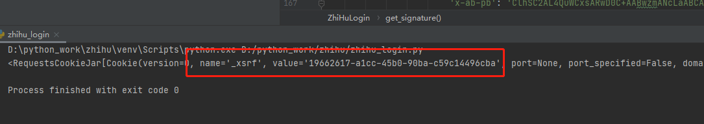
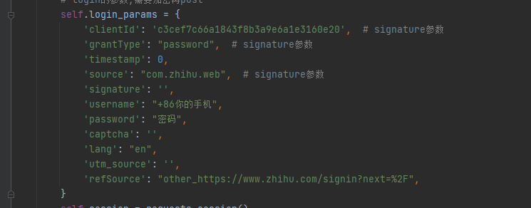
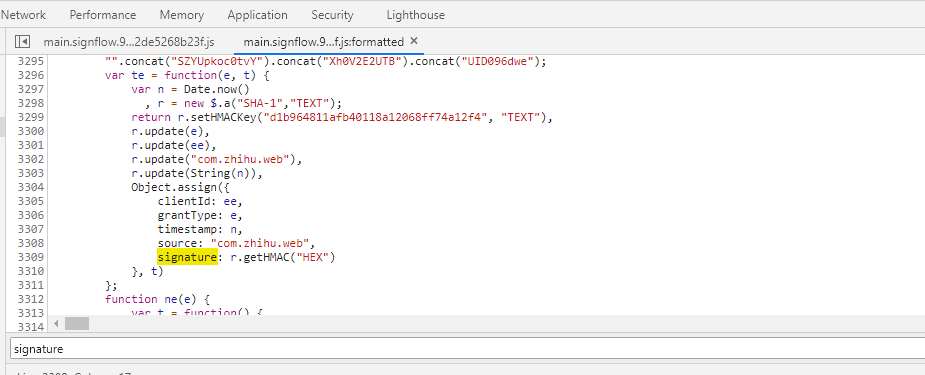
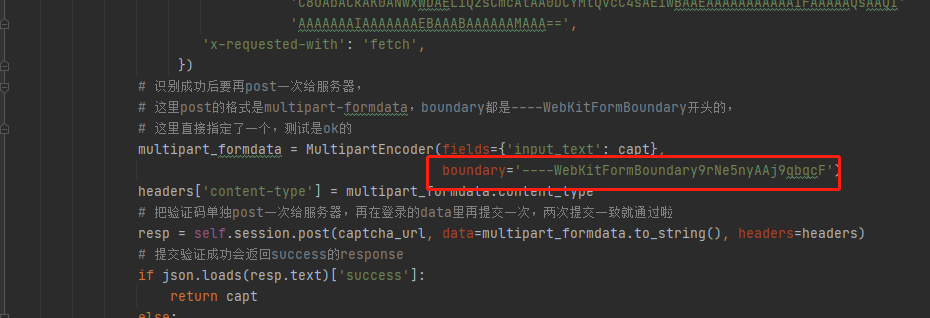
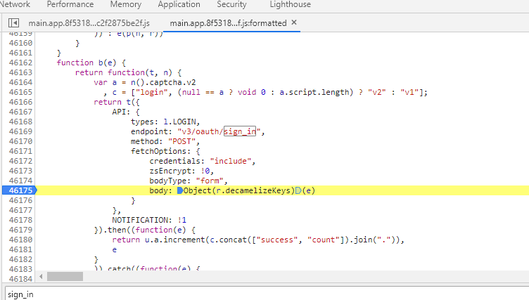
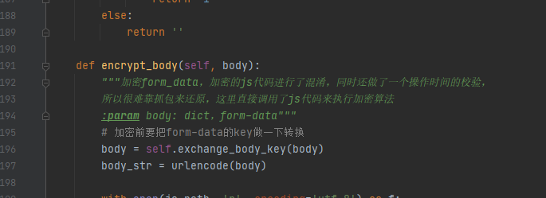
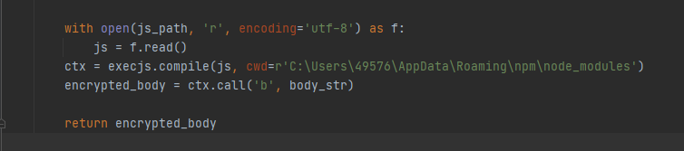
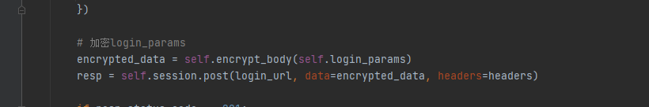

# 知乎模拟登录

> 最新的知乎模拟登录，包括验证码识别、cookies、js逆向
>
> 思路来自：<https://github.com/zkqiang/zhihu-login.git>，特别是打断点构建参数这一块
>
> 虽然已经写了详细的注释了，但是为了避免以后忘了，还是记录一下关键的点

### 构建headers

---

- x-xsrftoken

  一个token认证，如果没有这个参数的话会报错，可以单独get一次登陆页面(<https://www.zhihu.com/signin?next=%2F>)，get完后在session的cookies中可以找到（请求首页也有这个值，但是不知道为什么请求首页获得的值登录不了）



- x-zse-83

  一个不知道什么版本信息，但是没有它的话会返回说版本错误


### 构建form-data

---

​      

- 以下参数均为固定值
  

通过打断点调试，下面这些参数都是可以直接使用默认值的：

- `clinetId`这个是直接写在js里的，有可能以后就把值改掉了
  
  - `grantType`都是用密码登录，所以直接填上'password'就好了
  - `source`和`refsource`直接默认值
  - `lang`是验证码的类型，有两种：`en`和`cn`，分别对应英文和中文，因为是直接用打码网站做的识别，所以只用简单的英文的验证码就好了，看到有人说可以通过多次请求来绕过验证码，但是目前测试的结果是每次没有cookies信息的登录都是一定要验证码的，所以干脆就不绕了，直接识别算了
- `utm_source`不知道是什么来的，反正一直都是个空值
  
- `timstamp`

  13位的时间戳，python的int时间戳是10位的，所以要记得乘以1000

- `signature`

  把`clientId`、`grantType`、`source`和`timestamp` 做一次哈希(sha1)就行了，key也和`clientId`一样是直接写在js里的，在开发者工具的sources里搜一下就能找到了

   

- `captcha`

  验证码，如果不需要验证码则为空字符串，这里用的是英文的验证码，4位数字字母。

  api：<https://www.zhihu.com/api/v3/oauth/captcha?lang=en>

  知乎的验证码校验还是比较繁琐的

  通过抓包能看到一次登录需要三次请求验证码的api：

  + 第一次是get请求，这一次是必须的，返回的response会告诉你是否需要验证码
  + 如果第一次请求返回的结果是True，则需要再put一次api，返回的是base64的验证码img数据，这里返回的数据做过了转换，需要替换一下，可以对比返回的数据和原代码里图片数据的差异，目前是把`%0A`替换成了`%E2%86%B5`，替换回来就行了
  + 识别完验证码之后，再把验证码post回服务器，再加到参数里跟参数一起再提交一次就行了，这里要注意，post的content-type是multipart/form-data，里面有个`boundary`是以`----WebKitFormBoundary`开头的。python里封装form-data的话，boundary是一个随机的16位数，这里要记得替换一下，目前测试没有对boundary的值做什么校验，直接复制一个就行了

   

  还有记得要给post的headers里加上content-type

  ```python
  headers['content-type'] = multipart_formdata.content_type
  ```


### 加密form-data

---

加密的入口在这里：

 

这里会先对form-data的key做一个处理，从大写字母处切开，用`_`连接，再转换成小写，所以我们其实可以一开始就把key按这种格式写好，然后在调用加密函数前，要把form-data转换成encode的字符串

 

后面加密的算法太长了，还有时间限制，根本不是人能做的，所以干脆把整段代码复制出来了，直接调用

 

最后把加密后的body发给服务器就完事了

 


### Cookies

---

登录成功后可以直接把cookies存到数据库里，下一次用的时候就从数据库读出来，校验一下有效性就行了

```python
    def save_cookies(self):
        """
        把cookies转换为字符串并存在redis里
        :return: 0/1：是否插入成功
        """
        cookie = self.session.cookies
        # print(type(cookie))
        # 先转换为字典
        cookie_dict = dict_from_cookiejar(cookie)
        # 再转换为str
        cookie_str = json.dumps(cookie_dict)
        client = StrictRedis()
        # 先删除已经存储的cookie
        client.spop('zhihu')
        return client.sadd('zhihu', cookie_str)

    def get_cookies(self):
        """
        从redis中读取存储的cookie_str，转换成cookie格式
        :return: cookies或空字符串，空字符串表示没有存储的cookie
        """
        client = StrictRedis()
        cookie_str = client.smembers('zhihu')
        if not cookie_str:
            return ''
        cookies_dict = json.loads(cookie_str)
        cookie = cookiejar_from_dict(cookies_dict)

        return cookie

    def check_cookies(self, cookies):
        """
        使用redis中的cookie登录首页，校验cookie是否有效，如果没有跳转，说明cookie还有效，有跳转则说明cookie已经失效了
        :return: bool
        """
        session = requests.session()
        # 没有存储的cookie，需要登录获取
        if isinstance(cookies, str):
            return False
        session.cookies = cookies
        index_url = 'http://www.zhihu.com'
        headers = self.session.headers.copy()

        resp = session.get(index_url, headers=headers, allow_redirects=False)
        if resp.status_code == 200:
            return True

        return False
```

